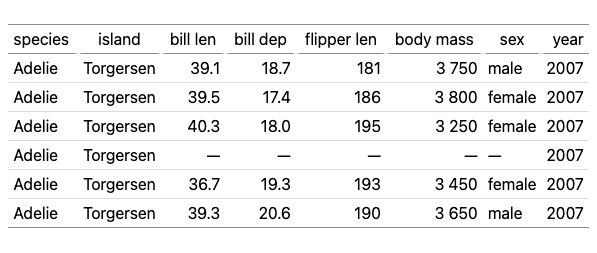

```{css, echo = FALSE}
@media only screen {
  pre > code {
    max-height: 30em;
  }
}
```

## The cheat sheet (table) {#sec:cheatsheet}

The table below is a self-documenting cheat sheet: every function in this
package is used to build it, and each function's name is placed where
that function acts. The title reads `lt_header(title = ...)` because
`lt_header()` put it there; every column header is the name of the function
that shaped that column; the row-group label is `lt_group()`; the footnote text
is `lt_footnote()`; and so on.

```{r}
d = data.frame(
  Grp   = paste("Group", c("A", "A", "B", "B")),
  Label = c("<a href='#sec:cheatsheet'>lt(): make a table</a>",
            "lt_indent(): child A",
            "lt_indent(): child B", "lt_style() + lt_css()"),
  Fmt   = c(1234567.89, -0.51234, Inf, -Inf),
  Sub   = c(0, NA, 3.14, 0.0002),
  Date  = as.Date(c("2024-01-15", "2024-02-20", "2024-03-25", "2024-04-30")),
  Align = c(1, 22, 333, 4),
  Width = c("lt_width()", "sets", "column", "widths"),
  Est   = c("0.61", "0.79", "0.45", "0.90"),
  CI    = c("(0.40, 0.82)", "(0.57, 1.01)", "(0.20, 0.70)", "(0.71, 1.14)")
)

library(lt)
lt(d, auto_format = FALSE) |>
  # lt_group(): the "lt_group()" row-group header on the left
  lt_group(~ Grp) |>
  # lt_header(): the title and subtitle at the top
  lt_header(
    title    = "lt_header(title = ...)",
    subtitle = "lt_header(subtitle = ...)"
  ) |>
  # lt_merge(): fold CI into Est to make the "lt_merge()" column
  lt_merge(~ Est + CI, pattern = "{1} {2}") |>
  # lt_spanner(): the "lt_spanner()" label above two columns
  lt_spanner(`lt_spanner()` ~ Fmt + Sub) |>
  # lt_label(): every column header is renamed to the function acting on it
  lt_label(
    Grp = "lt_group()", Width = "lt_width()", Label = "lt_label(old = new, ...)",
    Fmt = "lt_format()", Sub = "lt_sub()", Date = "lt_date()",
    Align = "lt_align()", Est = "lt_merge()"
  ) |>
  # lt_html(): render the "Label" column as raw HTML (note the link in row 1)
  lt_html(~ Label) |>
  # lt_align(): center the "lt_align()" column
  lt_align(~ Align, "center") |>
  # lt_width(): the "lt_width()" column is where widths are set
  lt_width(Width = "9em", Label = "16em") |>
  # lt_format(): round and add a thousands separator
  lt_format(~ Fmt, decimals = 1, big_mark = ",") |>
  # lt_date(): format the "lt_date()" column
  lt_date(~ Date, options = list(
    year = "numeric", month = "short", day = "numeric", timeZone = "UTC"
  )) |>
  # lt_sub(): NA/zero/small are replaced with self-naming placeholders
  lt_sub(~ Sub, missing = "n/a", zero = "—",
    small = 0.01, small_text = "< 0.01") |>
  # lt_indent(): indent the two "lt_indent()" child rows
  lt_indent(c(2, 3), level = 1) |>
  # lt_style() + lt_css(): style the cell that names them
  lt_style("Label", rows = 4L, class = "highlight") |>
  lt_css(.highlight = list(fontWeight = "bold", color = "#c60")) |>
  # lt_footnote(): provide the footnote text
  lt_footnote("lt_footnote() can add a footnote anywhere.", "title") |>
  lt_footnote(I("<code>Alt + Click</code> a table to toggle raw values."), "subtitle") |>
  # I(): wrapping text in I() marks it as raw HTML (here, a bold tag)
  lt_footnote(I("Wrap text in <code>I()</code> for raw HTML."), "column", "Label") |>
  # lt_move(): explain it via a footnote, since it has no column of its own here
  lt_footnote("lt_move() can reorder columns as desired.", "column", "Est") |>
  # lt_note(): the footer note names itself and lt_export()
  lt_note("lt_note() — and lt_export() saves this table to HTML/PDF/PNG.")
```

## Basics

### A simple table

Pass any data frame to `lt()`:

```{r}
tbl_cars = lt(head(mtcars))
tbl_cars
```

### Column labels

By default, column names are cleaned for display by replacing `.` and
`_` with spaces. Use `auto_label = FALSE` to show raw names, or
`lt_label()` to override specific columns:

```{r}
tbl_iris = lt(head(iris))
tbl_iris
lt(head(iris), auto_label = FALSE)
tbl_iris |> lt_label(Sepal.Length = "Length (cm)", Sepal.Width = "Width (cm)")
```

### Title and subtitle

```{r}
tbl_iris |>
  lt_header(title = "Iris Measurements", subtitle = "First six observations")
```

### Column alignment

By default, numeric columns are right-aligned and character columns are
left-aligned. Override with `lt_align()`:

```{r}
tbl_cars |> lt_align(~ mpg + cyl, "center") |> lt_width(mpg = "6em")
```

## Formatting

### Auto-formatting

By default, `lt()` automatically formats numeric columns: rounding to
~4 significant digits (adapting decimal places to magnitude), adding a
thin-space thousands separator, using a typographic minus (U+2212) for
negatives, detecting percentage columns (names containing `%`, `_pct`,
or `_percent`) and multiplying by 100 with a `%` suffix, and skipping
year-like columns. Set `auto_format = FALSE` to display raw values:

```{r}
d = data.frame(
  Year = c(2020, 2021, 2022),
  Revenue = c(1234567.89, 2345678.12, -3456.789),
  Margin_pct = c(0.1234, 0.0567, 0.2345)
)
lt(d)
lt(d, auto_format = FALSE)
```

### Number formatting

```{r}
tbl_cars |> lt_format(~ mpg + disp, decimals = 1)
```

#### Decimal places

Control the number of decimal places with `decimals`:

```{r}
d = data.frame(
  Metric = c("Revenue", "Costs", "Profit"),
  Q1 = c(1234567.891, 987654.321, 246913.570),
  Q2 = c(1345678.912, 1012345.678, 333333.234)
)
lt(d) |>
  lt_format(~ Q1 + Q2, decimals = 2)
```

#### Significant digits

Instead of fixing the number of decimal places, use `sig_digits` to keep a
fixed number of significant digits. This is handy when a column spans several
orders of magnitude, since small and large values each retain the same number
of meaningful digits:

```{r}
d3 = data.frame(
  Particle = c("Electron", "Proton", "Alpha"),
  Mass = c(0.00054858, 1.00727647, 4.00150618)
)
lt(d3) |> lt_format(~ Mass, sig_digits = 3)
```

`sig_digits` cannot be combined with `decimals`.

#### Big mark (thousands separator)

```{r}
lt(d) |>
  lt_format(~ Q1 + Q2, decimals = 0, big_mark = ",")
```

#### Prefix and suffix (currency, units)

Use `prefix` and `suffix` to prepend or append symbols to formatted values:

```{r}
lt(d) |>
  lt_format(~ Q1 + Q2, decimals = 2, big_mark = ",", prefix = "$")
```

```{r}
d2 = data.frame(
  Material = c("Steel", "Aluminum", "Copper"),
  Weight = c(1250, 340.5, 89.12)
)
lt(d2) |> lt_format(~ Weight, decimals = 1, suffix = " kg")
```

### Date formatting

Format Date or POSIXt columns using JavaScript's native Date methods.
The default uses `toLocaleDateString()`.

**Note:** The formatted date may differ from the input depending on the
viewer's timezone. `new Date("2024-01-15")` is parsed as UTC midnight,
but `toLocaleDateString()` converts to local time — so `2024-01-15`
displays as `2024-01-14` at GMT-6. Pass `options = list(timeZone =
"UTC")` to avoid this.

```{r}
d = data.frame(
  Event = c("Launch", "Update", "Release"),
  Date = as.Date(c("2024-01-15", "2024-06-30", "2024-12-01"))
)
lt(d) |> lt_date(~ Date)
```

#### With locale and options

Pass `locale` and `options` for `Intl.DateTimeFormat` control:

```{r}
lt(d) |> lt_date(~ Date, locale = "zh-CN",
  options = list(year = "numeric", month = "long", day = "numeric",
    weekday = "long", timeZone = "UTC"))
```

#### Using a specific Date method

```{r}
lt(d) |> lt_date(~ Date, method = "toDateString")
```

#### Datetime (POSIXt) columns

For datetime values, include time components in `options`:

```{r}
d = data.frame(
  Event = c("Start", "End"),
  Time = as.POSIXct(c("2024-01-15 09:30:00", "2024-01-15 17:45:00"), tz = "UTC")
)
lt(d) |> lt_date(~ Time, locale = "en-US", options = list(
  year = "numeric", month = "short", day = "numeric",
  hour = "2-digit", minute = "2-digit"
))
```

### Substituting missing/small values

```{r}
d = data.frame(
  Metric = c("HR", "p-value", "Events", "Rate"),
  Value = c(0.62, 0.0003, 0, NA)
)
lt(d) |>
  lt_format(~ Value, decimals = 2) |>
  lt_sub(~ Value, missing = "n/a", zero = "—", small = 0.001, small_text = "< 0.001")
```

### Infinity values

`Inf` and `-Inf` render as ∞ and −∞. Auto-formatting uses a typographic minus
(U+2212) for −∞; raw (unformatted) columns use an ASCII hyphen:

```{r}
d = data.frame(
  Metric = c("Lower bound", "Upper bound", "Rate", "Missing"),
  Value = c(-Inf, Inf, 1.5, NA)
)
lt(d) |> lt_format(~ Value, decimals = 2)
```

## Footnotes and notes

### Footnotes

A footnote can be attached to any of six locations via the `where`
argument: the `title`, the `subtitle`, a `column` label, a `spanner`
label, a row `group` label, or one or more `body` cells. The example
below shows all six at once:

```{r}
d = data.frame(
  Arm   = c("Treatment", "Treatment", "Control", "Control"),
  Stat  = c("n", "Mean", "n", "Mean"),
  Value = c(31, 6.8, 30, 4.2),
  SE    = c(NA, 0.42, NA, 0.38)
)
lt(d) |>
  lt_group(~ Arm) |>
  lt_header(title = "Study Results", subtitle = "Two arms") |>
  lt_spanner(`Summary` ~ Value + SE) |>
  # title and subtitle
  lt_footnote("Source: simulated trial data.", "title") |>
  lt_footnote("Intention-to-treat population.", "subtitle") |>
  # a column label
  lt_footnote("Standard error of the mean.", "column", "SE") |>
  # a spanner label
  lt_footnote("Per-arm summary statistics.", "spanner", "Summary") |>
  # a row-group label
  lt_footnote("Received active drug.", "group", "Treatment") |>
  # specific body cells (column + rows)
  lt_footnote("SE undefined for counts.", "body", "SE", rows = c(1, 3))
```

### Notes

Notes appear in the footer below numbered footnotes:

```{r}
tbl_cars |> lt_note("Data from the 1974 Motor Trend US magazine.")
```

## Row groups

### Group by column

Pass a column name to `lt_group()` to partition rows by that column's
values. The column is removed from the body and its values become group
headers:

```{r}
d = data.frame(
  Region = c("East", "East", "West", "West", "West"),
  City = c("New York", "Boston", "Seattle", "Portland", "Denver"),
  Population = c(8336817, 675647, 737015, 652503, 715522)
)
lt(d) |>
  lt_group(~ Region) |>
  lt_header(title = "US Cities by Region") |>
  lt_format(~ Population, big_mark = ",")
```

### Auto separator rows for long labels

By default (`sep = 'auto'`), `lt_group()` switches from rowspan cells to
full-width separator rows when any group label exceeds 20 characters:

```{r}
d = data.frame(
  Department = c(
    "Cardiovascular Research", "Cardiovascular Research",
    "Biostatistics", "Biostatistics"
  ),
  Trial = c("ATLAS-2", "BEACON", "PRIME-1", "NEXUS"),
  N = c(450, 320, 280, 510)
)
# "Cardiovascular Research" (23 chars) triggers separator mode automatically
lt(d) |> lt_group(~ Department)
# force rowspan mode with sep = FALSE
lt(d) |> lt_group(~ Department, sep = FALSE)
```

### Group by multiple columns (rowspan)

Pass multiple columns to `lt_group()` to render hierarchical rowspan
cells on the left side of the table:

```{r}
d = data.frame(
  Region = c("East", "East", "East", "West", "West", "West"),
  State = c("NY", "NY", "MA", "WA", "WA", "OR"),
  City = c("New York", "Buffalo", "Boston", "Seattle", "Spokane", "Portland"),
  Population = c(8336817, 278349, 675647, 737015, 228989, 652503)
)
lt(d) |>
  lt_group(~ Region + State) |>
  lt_header(title = "Cities by Region and State") |>
  lt_format(~ Population, big_mark = ",")
```

### Separator-row style

Use `sep = TRUE` to render groups as full-width separator rows instead of
rowspan cells:

```{r}
d = data.frame(
  Region = c("East", "East", "West", "West", "West"),
  City = c("New York", "Boston", "Seattle", "Portland", "Denver"),
  Population = c(8336817, 675647, 737015, 652503, 715522)
)
lt(d) |>
  lt_group(~ Region, sep = TRUE) |>
  lt_header(title = "US Cities by Region") |>
  lt_format(~ Population, big_mark = ",")
```

### Manual row groups

Use named arguments in `lt_group()` for explicit control over which rows
belong to each group:

```{r}
tbl_cars |> lt_group("First three" = 1:3, "Last three" = 4:6)
```

### Row group ordering

```{r}
d = data.frame(
  arm = c("Placebo", "Placebo", "Treatment", "Treatment"),
  stat = c("n", "Mean", "n", "Mean"),
  value = c("30", "4.2", "31", "6.8")
)
lt(d) |>
  lt_group(~ arm, sep = TRUE) |>
  lt_group("Treatment", "Placebo")
```

### Row indentation

Indent the first column to show hierarchy:

```{r}
d = data.frame(
  label = c("Any AE", "SOC: Cardiac", "Tachycardia", "Bradycardia",
            "SOC: GI", "Nausea"),
  n_pct = c("45 (67%)", "30 (45%)", "15 (22%)", "18 (27%)", "20 (30%)", "12 (18%)")
)
lt(d) |>
  lt_header("Adverse Events", "Safety Population") |>
  lt_indent(c(2, 5), level = 1) |>
  lt_indent(c(3, 4, 6), level = 2)
```

## Column structure

### Column spanners

A spanner groups contiguous columns under a shared label:

```{r}
tbl_iris |>
  lt_spanner(Sepal ~ Sepal.Length + Sepal.Width) |>
  lt_spanner(Petal ~ Petal.Length + Petal.Width)
```

#### Auto-inferred spanners

When column names share a common prefix separated by `.` or `_`, call
`lt_spanner()` with no arguments to infer spanners automatically:

```{r}
tbl_iris |> lt_spanner()
```

#### Spanner with formatting

```{r}
tbl_iris |>
  lt_header(title = "Iris Dataset") |>
  lt_spanner(Sepal ~ Sepal.Length + Sepal.Width) |>
  lt_spanner(Petal ~ Petal.Length + Petal.Width) |>
  lt_format(~ Sepal.Length + Sepal.Width + Petal.Length + Petal.Width, decimals = 1)
```

### Column merging

Combine columns into one using a pattern. Source columns are hidden
automatically:

```{r}
d = data.frame(
  stat = c("Age", "Weight", "Height"),
  n = c(67, 65, 64),
  pct = c(100, 97.0, 95.5)
)
lt(d) |>
  lt_format(~ pct, decimals = 1) |>
  lt_merge(~ n + pct, pattern = "{1} ({2}%)") |>
  lt_label(n = "n (%)")
```

#### Conditional merge with `<< >>`

Wrap pattern sections in `<<` and `>>` to drop them when any referenced
column is empty/NA:

```{r}
d = data.frame(
  endpoint = c("Primary", "Secondary", "Tertiary"),
  est = c(0.61, 0.79, 0.45),
  ci_lo = c(0.40, 0.57, NA),
  ci_hi = c(0.82, 1.01, NA)
)
lt(d) |>
  lt_format(~ est + ci_lo + ci_hi, decimals = 2) |>
  lt_merge(~ est + ci_lo + ci_hi, pattern = "{1}<< ({2}, {3})>>") |>
  lt_label(est = "Estimate (95% CI)")
```

### Column widths

```{r}
tbl_cars |> lt_width(mpg = "8em", cyl = "5em", disp = "8em", hp = "6em")
```

### Table width

Pass a single unnamed argument to `lt_width()` to set the width of the
whole table. It can be combined with named column widths:

```{r}
tbl_iris |> lt_width("80%")
tbl_iris |> lt_width("100%", Species = "20em")
```

### Column reordering

```{r}
tbl_iris |> lt_move(~ Petal.Length + Petal.Width, after = NULL)
```

### Hiding columns

`lt_hide()` drops columns from the table without dropping their data: the
values still travel in the spec, so they stay available to anything that
reads the whole row (e.g. an interactive table's row detail, below).

```{r}
tbl_iris |> lt_hide(~ Petal.Length + Petal.Width)
```

## Inline plots

These functions draw a tiny chart into a column's cells. All are lightweight:
only the numbers travel to the browser and the SVG is drawn there, so for an
interactive table only the current page's rows are drawn.

### Error bars

`lt_errorbar()` renders a numeric column's cells as a small inline SVG — a
point at the estimate with a horizontal bar (and end caps) from the lower to
the upper bound — all drawn on a scale shared across the column, so rows are
comparable at a glance (a forest plot of effect sizes with confidence
intervals). Name the three columns with a two-sided formula
`value ~ lower + upper` or a vector `c(value, lower, upper)`; the bound
columns are hidden by default (`hide = FALSE` keeps them). Pass `ref` to draw
a vertical reference line (e.g. `0` for a risk difference). Set `axis = TRUE`
(or a string caption) to add a shared axis in the footer — a baseline with
tick marks and labels at "nice" round values, matching faint gridlines inside
each cell.

```{r}
d_eff = data.frame(
  Term = c("Age", "Dose", "Baseline", "Sex"),
  Est  = c(0.12, -0.34, 0.45, -0.08),
  Lo   = c(-0.05, -0.52, 0.21, -0.29),
  Hi   = c(0.29, -0.16, 0.69, 0.13)
)
lt(d_eff) |>
  lt_errorbar(Est ~ Lo + Hi, ref = 0, axis = "Effect (95% CI)")
```

Several series can share one cell: pass one `value ~ lower + upper` per series
and each row stacks one point-and-bar on the same scale (e.g. a risk difference
for each of several treatment arms). `color` and `labels` key the series in a
footer legend, as for `lt_dotplot()`.

```{r}
d_grp = data.frame(
  Term = c("Headache", "Nausea", "Fatigue"),
  D1 = c(2.1, -1.4, 3.3), L1 = c(-1.0, -4.2, 0.1), U1 = c(5.2, 1.4, 6.5),
  D2 = c(-0.5, 0.8, 1.2), L2 = c(-3.6, -2.1, -1.9), U2 = c(2.6, 3.7, 4.3)
)
lt(d_grp) |>
  lt_errorbar(
    D1 ~ L1 + U1, D2 ~ L2 + U2, ref = 0, color = TRUE,
    labels = c("Drug A", "Drug B"), axis = "Risk difference (%)"
  )
```

### Sparklines

`lt_sparkline()` draws a per-row series as a small line or bar chart. The
series can be a single list-column (each cell a numeric vector) or several
numeric columns read across the row (`~ a + b + c`, all but the first hidden by
default). Each row is scaled to its own range unless `limits` sets a shared
scale; `type = "bar"` draws bars instead of a line.

```{r}
d_spark = data.frame(City = c("Oslo", "Cairo", "Lima"))
# a list-column: each cell is a vector of monthly values
d_spark$Temp = list(
  c(-3, -2, 1, 6, 12, 16), c(14, 15, 18, 23, 28, 31), c(19, 19, 18, 16, 15, 15)
)
d_spark$Rain = list(
  c(49, 36, 47, 41, 53, 60), c(5, 4, 4, 1, 0, 0), c(8, 4, 2, 1, 1, 1)
)
lt(d_spark) |>
  lt_sparkline(~ Temp) |>
  lt_sparkline(~ Rain, type = "bar", color = "#4caf50")
```

### Dot plots

`lt_dotplot()` draws one dot per column on a scale shared across them, so a row
with N columns shows N dots laid out by value — handy for comparing a few
measurements per row (e.g. before vs. after). Name the value columns with
`~ a + b + c` (all but the first hidden by default). `color = TRUE` colors the
dots from the palette and adds a footer legend; a vector of colors sets them
explicitly. A shared axis is drawn in the footer by default (`axis = FALSE` to
drop it, or a string for a caption).

```{r}
d_dot = data.frame(
  Group = c("Control", "Low", "High"),
  Before = c(3.1, 3.4, 3.0), After = c(3.3, 4.1, 5.2)
)
lt(d_dot) |>
  lt_dotplot(~ Before + After, color = TRUE, axis = "Score")
```

When two dots fall at nearly the same value they overlap; `stagger = TRUE`
spreads near-equal dots onto separate tracks so each stays visible.

```{r}
lt(d_dot) |>
  lt_dotplot(~ Before + After, color = TRUE, stagger = TRUE, axis = "Score")
```

## Styling

### Cell styling

Highlight specific cells with bold, color, background, or any CSS
property (camelCase or dash-case):

```{r}
d = data.frame(
  Endpoint = c("Primary", "Secondary", "Exploratory"),
  HR = c(0.62, 0.79, 0.91),
  P = c(0.001, 0.042, 0.38)
)
lt(d) |>
  lt_format(~ HR, decimals = 2) |>
  lt_format(~ P, decimals = 3) |>
  lt_style("P", rows = 1:2L, bold = TRUE, color = "#06c") |>
  lt_style("HR", rows = 1L, bg = "#e8f4e8", borderBottom = "2px solid #4a4")
```

### Conditional styling

Apply styles based on cell values using a JavaScript test function. Use
`class` to assign CSS classes, then define the rules with `lt_css()`:

```{r}
d = data.frame(
  Endpoint = c("Primary", "Secondary", "Exploratory"),
  HR = c(0.62, 0.79, 1.05),
  P = c(0.001, 0.042, 0.38)
)
lt(d) |>
  lt_format(~ HR + P, decimals = 3) |>
  lt_style("HR", test = "v => v < 1", class = "good") |>
  lt_style("P", test = "v => v < 0.05", class = "sig") |>
  lt_css(.good = list(color = "green"), .sig = list(fontWeight = "bold"))
```

### Highlighting NA cells

```{r}
d = data.frame(
  arm = c("Treatment", "Control", "Treatment"),
  n = c(30, NA, 28),
  response = c(0.67, NA, NA)
)
lt(d) |>
  lt_style(test = "v => v == null", class = "na") |>
  lt_css(.na = list(background = "#fee"))
```

### HTML content

By default, every cell value and text label is HTML-escaped, so characters
like `<`, `>`, and `&` render as literal text. To emit raw HTML instead —
links, emphasis, images, and so on — use `lt_html()` to mark whole body
columns, and wrap any other text (titles, labels, footnotes, notes,
spanners) in `I()`:

```{r}
d = data.frame(
  Package = c(
    "<a href='https://cran.r-project.org/package=lt'>lt</a>",
    "<a href='https://cran.r-project.org/package=xfun'>xfun</a>"
  ),
  Status = c("<b style='color:#090'>stable</b>", "<i>active</i>")
)
lt(d) |>
  lt_html(~ Package + Status) |>
  lt_header(I("Packages <sup>&#9733;</sup>")) |>
  lt_label(Package = I("Name<sup>*</sup>")) |>
  lt_note(I("See <a href='https://yihui.org/'>the author</a>."))
```

## Complete example

```{r}
d = data.frame(
  Group = c("Treatment", "Treatment", "Control", "Control"),
  Endpoint = c("Primary", "Secondary", "Primary", "Secondary"),
  Estimate = c(0.6123, 0.7891, 0.4567, 0.5432),
  CI_Lower = c(0.4012, 0.5678, 0.2345, 0.3210),
  CI_Upper = c(0.8234, 1.0104, 0.6789, 0.7654),
  P_Value = c(0.0012, 0.0456, 0.1234, 0.2345)
)
lt(d) |>
  lt_group(~ Group) |>
  lt_header(
    title = "Study Results",
    subtitle = "Primary and secondary endpoints"
  ) |>
  lt_spanner(`95% CI` ~ CI_Lower + CI_Upper) |>
  lt_format(~ Estimate + CI_Lower + CI_Upper, decimals = 3) |>
  lt_format(~ P_Value, decimals = 4) |>
  lt_footnote("Two-sided p-value from log-rank test.", "column", "P_Value")
```

## Exporting

```{r, include = FALSE}
# lt_export() to PDF/PNG (and baking a static <table>) needs an external
# renderer (Node.js or a headless browser), which is unavailable in some
# environments such as webR. Gate those chunks so the document still renders
# there.
can_export = lt:::can_bake()
```

`lt_export()` saves a table to a file. The format is chosen from the file
extension: `.html`, `.pdf`, or (otherwise) `.png`. PDF and PNG are rendered in
a headless Chromium browser.

```{r}
tbl = lt(head(penguins))
```

```{r, eval = can_export}
lt_export(tbl, "01-lt.png")
```

:::: {#fig:lt-png .figure}


::: caption
[ ](#@fig:lt-png) A table exported to PNG.
:::
::::

```{r, eval = can_export}
lt_export(tbl, "01-lt.pdf")
```

:::: {#fig:lt-pdf .figure}
<embed src="01-lt.pdf" type="application/pdf" width="100%" height="400">

::: caption
[ ](#@fig:lt-pdf) A table exported to PDF.
:::
::::

For `.html` output, the table can be baked into a static `<table>` (built once
by running the lt.js runtime, so the saved file needs no JavaScript to view).
Set `tidy = TRUE` to pretty-print it with line breaks and indentation:

```{r, attr.output = '.html', eval = can_export}
lt_export(tbl, NA, fragment = TRUE, css = FALSE, tidy = TRUE)
```

## Interactivity

### Raw values

When cell values are formatted, the original values are available in
tooltips (hover over a cell to see). You can also `Alt + Click` on a
table to reveal all raw values at once, or `Alt + Double-Click` to
toggle raw values for all tables on the page.

### Sorting, searching, filtering, and paging

`lt_interactive()` turns a table into an interactive one: click a column
header to sort by it (ascending, descending, then unsorted), type in the
search box above the table to keep only the rows that match, and walk
through the rows a page at a time with the pager below the table. Paging
is on by default; the page sizes to offer are given as a vector, the
first of which is used initially.

```{r}
d = mtcars[, c("mpg", "cyl", "hp", "wt", "gear")]
lt(d) |> lt_interactive(pager = c(5, 10, Inf))
```

Shift-click a second header to sort by it as a tie-breaker, so several
columns sort at once (an ordinal in each header marks its place). An
initial sort can be requested with `sort` as a one-sided formula (below);
a `-` prefix (a negated formula term) sorts a column descending.

```{r}
lt(d) |> lt_interactive(sort = ~ cyl + -mpg, pager = 10, search = FALSE)
```

The extra controls (and the JavaScript that drives them) are only loaded
for tables that call `lt_interactive()`, so other tables cost nothing.

A search term is matched case-insensitively against the displayed text,
and a leading `!` negates it (e.g. `!merc` keeps the rows that do *not*
mention Mercedes). A term that mentions `x` is instead evaluated as a
JavaScript expression against each raw cell value, so `x > 20` keeps the
rows with a value above 20 in any column.

`filter = TRUE` adds a box under each column header, matching the same
way but against that column alone; a row is kept when it passes every
filter and the search. Pass a character vector to filter on some columns
only.

```{r}
lt(d) |> lt_interactive(filter = TRUE, search = FALSE, pager = 5)
```

A column can take a *typed* control instead of a plain box: pass a named
list where each column maps to `"select"` (a value dropdown), `"range"`
(a two-thumb slider), or `"checklist"` (a popover of checkboxes). The
dropdown's and checklist's choices and the slider's ends are read from the
column's data. The control renders as a funnel under the header, paired
with an expression box that stays in sync. One *unnamed* entry is the
default for every other column.

A `"select"` keeps the one value chosen; a `"checklist"` keeps every value
whose box is checked (all checked is the no-filter state), so the reader
can keep several at once.

```{r}
lt(d) |> lt_interactive(
  filter = list(TRUE, cyl = "checklist", wt = "range", gear = "select"),
  search = FALSE, pager = 5
)
```

### Row detail (drill-down)

`detail` adds an expand caret to each row; clicking it reveals a child
table built on the spot from that row. The simplest form names the columns
to show, as a character vector or a one-sided formula: their displayed
(formatted) values are laid out as a one-row table. The columns can be ones
hidden from the main table with `lt_hide()` — a natural way to tuck extra
fields into the detail. Here `hp` and `wt` are hidden above but surfaced in
the detail.

```{r}
lt(d) |>
  lt_hide(~ hp + wt) |>
  lt_interactive(pager = 5, detail = ~ hp + wt)
```

For full control, pass a JavaScript callback yourself, wrapped in `js()`.
It is called as `(row, index, display)`: `row` has the raw values,
`display` the formatted text, each keyed by column name. Return a table
spec; give it an `interactive` field to make the detail table itself
interactive, as below where it is made sortable.

```{r}
lt(d) |>
  lt_hide(~ hp + wt) |>
  lt_interactive(
    pager = 5,
    detail = js('(row, i, d) => ({
      data: { field: ["row", "hp", "wt"], value: [i, d.hp, d.wt] },
      interactive: { sort: ["value"], search: false }
    })')
  )
```

### Resizable columns

With `resize = TRUE`, each column can be resized by dragging the right
edge of its header; double-clicking that edge fits the column to its
content. Widening a column widens the table, leaving the other columns
as they are. Initial widths come from `lt_width()` as usual.

```{r}
lt(head(d)) |> lt_interactive(resize = TRUE, pager = FALSE, search = FALSE) |>
  lt_width(mpg = "8em")
```

### Column visibility

`hide` adds an eye button at the start of the search row that opens a
checklist of every column; unchecking one hides it (header and cells),
re-checking brings it back. Use `hide = TRUE` to start with all columns
shown, or name columns (a character vector or a one-sided formula) to
start with those hidden (they are still listed, so the reader can bring
them back). The checklist shows each column's displayed label.

```{r}
lt(d) |> lt_interactive(hide = ~ hp + wt, pager = 5)
```

### Downloading a CSV

`download` adds a button to the control bar that downloads the table's
current view — every row the filters and the search keep, in sort order,
across all pages — as a CSV file, using the displayed cell text. Use
`download = TRUE` for a default file name, or pass a string to set it (a
`.csv` extension is added if missing). Try filtering or sorting first: the
file holds exactly what the table shows.

```{r}
lt(d) |> lt_interactive(download = "cars.csv", filter = TRUE, pager = 5)
```

### Row groups and indentation

Row structure is honored: sorting and filtering happen *within* each
group or subtree, never across it, so a group header never parts from
its rows and an indented child never loses its parent. Separator row
groups keep their order, and a group whose rows all filter out drops its
header. Paging works too: a group split across a page boundary re-shows
its header at the top of the next page.

```{r}
d2 = data.frame(
  Region = rep(c("East", "West", "South"), each = 3),
  City = c("NYC", "Boston", "Philly", "LA", "Reno", "Boise",
           "Austin", "Miami", "Atlanta"),
  Sales = c(42, 17, 23, 55, 9, 14, 31, 48, 26)
)
lt(d2) |> lt_group(~ Region, sep = TRUE) |> lt_interactive(pager = 5)
```

Rowspan row groups (the default `lt_group()` rendering) sort and filter
within each run too; clicking a group header reorders whole blocks, and
with several group columns the view stays nested (an inner column
reorders only within its parent block). The spanning cells are redrawn
to match.

```{r}
lt(d2) |> lt_group(~ Region) |> lt_interactive(pager = 5)
```

Indentation sorts siblings under each parent, carrying each subtree
along; filtering a descendant keeps its ancestors visible for context.

```{r}
d3 = data.frame(
  Item = c("Fruit", "Apple", "Pear", "Berry", "Grain", "Rice", "Oat", "Wheat"),
  Qty = c(0, 12, 7, 5, 0, 30, 8, 19)
)
lt(d3) |> lt_indent(c(2, 3, 4, 6, 7, 8), level = 1) |> lt_interactive(pager = 5)
```

Column spanners, styles, and footnotes are no obstacle to interactivity.
